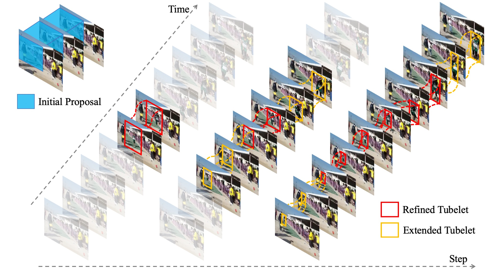
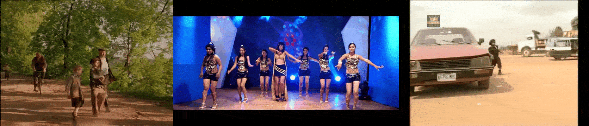

[](https://raw.githubusercontent.com/nvlabs/SPADE/master/LICENSE.md)


## STEP: Spatio-Temporal Progressive Learning for Video Action Detection


[[Paper]](http://openaccess.thecvf.com/content_CVPR_2019/papers/Yang_STEP_Spatio-Temporal_Progressive_Learning_for_Video_Action_Detection_CVPR_2019_paper.pdf) [[Supp]](http://xiaodongyang.org/publications/papers/step-supp-cvpr19.pdf) [[YouTube]]() [[Poster]]()

STEP: Spatio-Temporal Progressive Learning for Video Action Detection, CVPR 2019 (Oral) <br>
[Xitong Yang](http://users.umiacs.umd.edu/~xyang35/), [Xiaodong Yang](https://xiaodongyang.org/), [Ming-Yu Liu](http://mingyuliu.net/), [Fanyi Xiao](http://fanyix.cs.ucdavis.edu/), [Larry Davis](https://www.cs.umd.edu/people/lsdavis), [Jan Kautz](http://jankautz.com/) <br>



## Table of contents
* [News](#news)
* [Getting started](#getting-started)
    * [Installation](#installation)
    * [(Optional) Demo](#(optional)-demo)
* [Training on AVA Dataset](#training-on-ava-dataset)
    * [Dataset Preparation](#dataset-preparation)
    * [Testing](#testing)
    * [Training](#training)
    * [Tips](#tips)
* [Citation](#citation)
* [Relation Work](#relation-work)
* [License](#license)

## News

## Getting Started
### Installation
- Prerequisites: Python 3.6, Numpy, OpenCV
- Install Pytorch (>= 1.1.0) and torchvision (>= 0.2.1)
- (Optional) You may skip it. Install APEX for half-precision training:
```
git clone https://github.com/NVIDIA/apex.git
cd apex
python setup.py install --cuda_ext --cpp_ext
```
- Clone this repo:
```bash
git clone https://github.com/NVlabs/STEP.git
cd STEP/
```
- Install external packages (for RoI pooling / align and NMS):
```bash
python setup.py build develop
```

### (Optional) Demo
**Try STEP on your own video data!** Our model trained on AVA dataset can effectively detect common actions (stand, sit, walk, talk to, etc.) in general videos.

First, extract frames of your own videos and organize them in `datasets/demo/frames/` as follows:
```
|-- frames/
|   |-- <video_id1>/
|       |-- frame0000.jpg
|       |-- frame0001.jpg
|       |-- ...
|   |-- <video_id2>/
|   |-- ...
```

Second, modify the file `demo.py`:
- checkpoint\_path: the path to the trained STEP model. You can use the model you trained on your own (see [Training](#trainingkkkkkkkkkkkkj)), or our trained model downloaded from [Google drive](https://drive.google.com/file/d/11Lx7MqmmZFep9Sf_QA98gulK4i5QJ-H4/view?usp=sharing) and [Baidu drive]().
- args.data\_root: the path to your video frames. Default is `datasets/demo/frames/`
- source\_fps: frame rate of your own videos
- (optional) conf\_thresh and global\_thresh: thresholds for confidence scores and global NMS, these are values you can control for better visualization

Finally, run the script for action detection:
```bash
python demo.py
```
The detection results and visualization will be stored in `datasets/demo/results/` by default.

## Training on AVA Dataset
### Dataset Preparation
Download [AVA dataset](https://research.google.com/ava/download.html). Note that our code uses the version AVA **v2.1**.

Put all the annotation-related files into the folder `datasets/ava/label/`. Transform the origional annotation files in csv format to pickle files:
```bash
python scripts/generate_label.py <path_to_train_csv>
python scripts/generate_label.py <path_to_val_csv>
```

Extract frames from the downloaded videos and store them in `datasets/ava/frames/`. You can check out the code `scripts/extract_clips.py` for the process (ffmpeg is required). 

The extracted frames are organized as follows:
```
|-- frames/
|   |-- <video_id>/
|       |-- <timestamp>/ 
|           |-- <frame_id>
```
where each folder `<timestamp>/` contains the frames within a 1-second interval, starting from that timestamp (for example, the first frame 00000.jpg in the folder 01000/ corresponds to the frame exactly at timstamp 1000). This organization is made for precise alignment with the AVA annotations (in other words, the annotation at a certein timstamp corresponds to the first frame in the folder of that timestamp). As the annoations are provided at timestamps 902:1798 inclusive, we can safely extract the frames at timestamps only from 900 to 1800.

You can store your dataset and annotations in other directories. If so, you need to modify the default path values in the training scripts, as mentioned in the next section.

### Testing
We provide our trained models to reproduce the results in our paper. You can download the weights from [Google drive](https://drive.google.com/file/d/11Lx7MqmmZFep9Sf_QA98gulK4i5QJ-H4/view?usp=sharing) or [Baidu drive](), and put it in `pretrained/`.

Run the following command for testing and evaluation on AVA validation set:
```bash
python test.py
```
The output will be stored in `datasets/ava/cache/STEP-max3-i3d-two_branch/`.

STEP achieves **20.2% mAP** on AVA v2.1 dataset using this implementation (updated in the [arxiv version]()).

### Training
As the classification task on AVA dataset is very challenging, we perform classification pre-training on AVA using the ground truth annotations before training the detection models. Our classification pretrained weights (mAP = 26.4%) can be download from [Google drive](https://drive.google.com/file/d/1ml1M87IHFBuax-sY_KYKCy509IawtuH2/view?usp=sharing) and [Baidu drive](), and we put it in `pretrained/`.

Now we are ready to train STEP, using the following script:
```bash
cd scripts
bash train_step.sh
```
Note that you need to modify the values of `data_root`, `save_root` and `pretrain_path` if you store them in the other places.

You can train STEP with low precision (fp16), by add a flag `--fp16` at the end of the script file `scripts/train_step.sh` (APEX is required for fp16 training)

You can also train your own pretrained model using the following script:
```bash
cd scripts
bash train_cls.sh
```
If so, you need the kinetics-pretrained weights for the I3D network, which can be downloaded from [Google drive](https://drive.google.com/file/d/18dCg3-s86cjyCEgaPzFgP9z5Sp-K5yYS/view?usp=sharing) and [Baidu drive]() and then put in `pretrained/`.

### Tips
GPU memory requirement for the default setting (3 steps, 34 initial proposals, batch size 8):
- fp32, 4GPUs: >= 15G
- fp16, 4GPUs: >= 10G


## Citation
Please cite this paper if it helps your research:
```
@inproceedings{yang2019step,
title={STEP: Spatio-Temporal Progressive Learning for Video Action Detection},
author={Yang, Xitong and Yang, Xiaodong and Liu, Ming-Yu and Xiao, Fanyi and Davis, Larry S and Kautz, Jan},
booktitle={Proceedings of the IEEE Conference on Computer Vision and Pattern Recognition},
pages={264--272},
year={2019}
}
```

## Related Work
In folder `external/`, we modify the codes from [ActivityNet](https://github.com/activitynet/ActivityNet) for parsing annotation files and evaluation, and codes from [maskrcnn-benchmark](https://github.com/facebookresearch/maskrcnn-benchmark) for NMS and RoI pooling/align.
Please follow the corresponding liceses to use the codes.

## License
Copyright (C) 2019 NVIDIA Corporation. All rights reserved. Licensed under the [CC BY-NC-SA 4.0](https://creativecommons.org/licenses/by-nc-sa/4.0/legalcode) (**Attribution-NonCommercial-ShareAlike 4.0 International**). The code is released for academic research use only. For commercial use, please contact [researchinquiries@nvidia.com](researchinquiries@nvidia.com).
